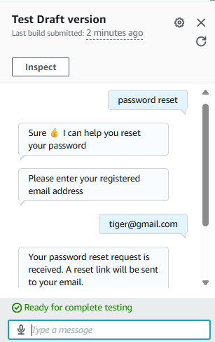
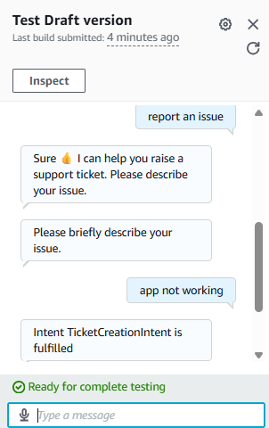

# Customer Support Chatbot using Amazon Lex

## Project Overview
This project is a cloud-based customer support chatbot developed using Amazon Lex V2 and AWS Lambda.

## Features
- Greeting users
- Password reset support
- Ticket creation support

## AWS Services Used
- Amazon Lex V2
- AWS Lambda
- IAM

## Architecture
User → Amazon Lex → AWS Lambda → Amazon Lex → User

## Screenshots

### Password Reset Flow

### Ticket Creation Flow

## Status
Project completed and tested using Amazon Lex Test Console.

